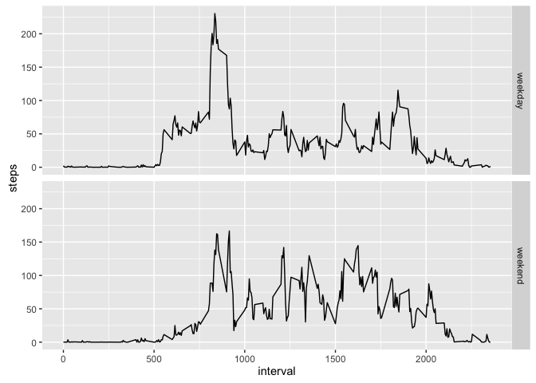

# Reproducible Research Week 2 Assignment
Jan van Bemmelen  
May 3, 2016  

This document is made for the assignment of week 2 of the reproducible research course on Coursera.

## Loading and preprocessing the data
This loads the csv file and changes the date column to hold values of type 'Date'.

```r
unzip("activity.zip")
activity <- read.csv("activity.csv")
activity$date <- as.Date(activity$date)
```

## What is mean total number of steps taken per day?
Get the total number of steps per day and present it in a histogram.

```r
total_per_day <- with(activity, tapply(steps, date, sum, na.rm=TRUE))
hist(total_per_day,ylim=c(0,25),xlab="Steps",main="Steps per day",10)
abline(v=mean(total_per_day),col="red",lw=3)
abline(v=median(total_per_day),col="blue",lw=3)
legend("topright",c("mean","median"),col=c("red","blue"),pch="-")
```


Give the mean and median:

```r
mean(total_per_day)
```

```
## [1] 9354.23
```

```r
median(total_per_day)
```

```
## [1] 10395
```

## What is the average daily activity pattern?
Get the average number of steps per interval across days and present it in a time series plot.

```r
average_per_interval <- with(activity, tapply(steps, interval, mean, na.rm=TRUE))
plot(names(average_per_interval),average_per_interval,type="l",ylab="mean steps",xlab="interval",main="Average steps per interval")
```


The maximum average number of steps is reached at this interval:

```r
names(average_per_interval[average_per_interval==max(average_per_interval)])
```

```
## [1] "835"
```

## Imputing missing values
Report the number of missing values:

```r
sum(is.na(activity$steps))
```

```
## [1] 2304
```
Replace missing values with the mean of the interval and assign it to a new dataset (activity2). Create a histogram of the new dataset.

```r
library(dplyr)
```

```r
get_mean_per_interval <- function(x){ replace(x, is.na(x), mean(x, na.rm=TRUE)) }
activity2 <- activity %>% group_by(interval) %>% mutate(steps=get_mean_per_interval(steps))
total_per_day_no_na <- with(activity2, tapply(steps, date, sum, na.rm=FALSE))
hist(total_per_day_no_na,ylim=c(0,25),xlab="Steps",main="Steps per day",10)
abline(v=mean(total_per_day_no_na),col="red",lw=6)
abline(v=median(total_per_day_no_na),col="blue",lw=2)
legend("topright",c("mean","median"),col=c("red","blue"),pch="-")
```


Both the mean and median are higher than the first values in the first part of the assignment. This is a result of the missing values in the original dataset.

```r
mean(total_per_day_no_na)
```

```
## [1] 10766.19
```

```r
median(total_per_day_no_na)
```

```
## [1] 10766.19
```

##Are there differences in activity patterns between weekdays and weekends?
Create a new factor variable in the dataset with two levels – "weekday" and "weekend" indicating whether a given date is a weekday or weekend day.

```r
days_of_the_week <- c("Mon","Tue","Wed","Thu","Fri")
get_day_type <- function(x){ ifelse(weekdays(x, abbreviate=TRUE) %in% days_of_the_week, "weekday", "weekend")}
activity2 <- mutate(activity2, type_of_day= get_day_type(date))
activity2$type_of_day <- as.factor(activity2$type_of_day)
par(mfrow=c(2,1))
aggr_type_of_day <- aggregate(steps ~ interval + type_of_day, data=activity2, mean)
```

Make a panel plot containing a time series plot (i.e. type = "l") of the 5-minute interval (x-axis) and the average number of steps taken, averaged across all weekday days or weekend days (y-axis).

```r
library(ggplot2)
```

```r
ggplot(aggr_type_of_day, aes(interval,steps))+geom_line()+facet_grid(type_of_day ~.)
```


